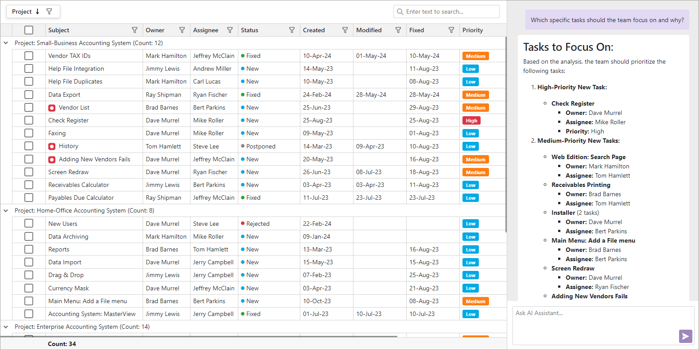
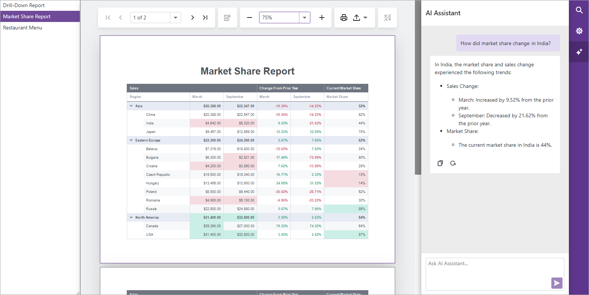

<!-- default badges list -->
[](https://supportcenter.devexpress.com/ticket/details/T1268742)
[](https://docs.devexpress.com/GeneralInformation/403183)
[](#does-this-example-address-your-development-requirementsobjectives)
<!-- default badges end -->
# Report Viewer and Grid for Blazor —  Integrate an AI Assistant based on Azure OpenAI

This example integrates an AI assistant to DevExpress Blazor Components. User requests and assistant responses are displayed on-screen using the [DevExpress Blazor AI Chat](http://docs.devexpress.com/Blazor/DevExpress.AIIntegration.Blazor.Chat.DxAIChat?v=24.2) component.

With an [Azure OpenAI Assistant](https://learn.microsoft.com/en-us/azure/ai-services/openai/how-to/assistant) integrated in our AI-chat component, you can filter and manipulate data, generate document summaries, and ask context-aware questions about report content, table data, and more — all within the user interface. 

This example demonstrates the following DevExpress Blazor Components:

- [Blazor Data Grid](https://www.devexpress.com/blazor/data-grid/)

    The Grid is bound to a project management data that tracks tasks or issues across various projects. It includes details like task subject, owner and assignee, status, priority, and key dates (created, modified, fixed). You can ask the AI Assistant questions about task data:      
    - What tasks should the team focus on first? 
    - How many tasks are currently marked as New? 
    - What tasks are of the highest priority for Mike Roller?

    Implementation details: [Add an AI Assistant to Blazor Grid](#add-an-ai-assistant-to-grid).

- [Blazor Report Viewer](https://www.devexpress.com/subscriptions/reporting/)

    The Report Viewer presents multiple reports bound to different data sources. The available reports include:

    - The *Drill-Down Report* displays invoices where the expandable/collapsible sections list purchased products. You can ask the AI Assistant such as: Which invoice has the highest total order value? How many orders are currently in transit, pending, or delivered? What is the average order value per invoice?
    - The *Market Share Report* includes sales figures, changes from the prior year, and current market share percentages for various regions and countries across different time periods. You can ask the AI Assistant such as: Which region had the highest market share in September? How did market share change for India? How does Canada’s market share growth compare to the USA’s?
    - The *Restaurant Menu* includes multiple groups, each group represents a different category and sub-category of meals and beverages. You can ask the AI Assistant such as: What are the price ranges for the menu items? Are there any vegetarian or non-meat options on this menu?

    Implementation details: [Add an AI Assistant to Blazor Report Viewer](#add-an-ai-assistant-to-report-viewer).

>[!TIP]
> Please note that AI Assistant initialization takes time. The assistant tab appears once Microsoft Azure scans the source document (i.e., grid or report data) on the server side.


## Implementation Details

### Register AI Services

> [!NOTE]  
> DevExpress AI-powered extensions follow the "bring your own key" principle. DevExpress does not offer a REST API and does not ship any built-in LLMs/SLMs. You need an active Azure/Open AI subscription to obtain the REST API endpoint, key, and model deployment name. These variables must be specified at application startup to register AI clients and enable DevExpress AI-powered Extensions in your application.

Add the following code to the *Program.cs* file to register the AI Services and an [OpenAI Assistant](https://platform.openai.com/docs/assistants/overview) in your application:

```cs
using Azure.AI.OpenAI;
using DevExpress.AIIntegration;
using Microsoft.Extensions.AI;
using System.ClientModel;
//...
string azureOpenAIEndpoint = "AZURE_OPENAI_ENDPOINT";
string azureOpenAIKey = "AZURE_OPENAI_API_KEY";
string deploymentName = "YOUR_MODEL_NAME";
//...
var azureClient = new AzureOpenAIClient(
    new Uri(azureOpenAIEndpoint),
    new ApiKeyCredential(azureOpenAIKey));
builder.Services.AddChatClient(config => 
    config.Use(azureClient.AsChatClient(deploymentName))
);
builder.Services.AddDevExpressAI((config) => {
    config.RegisterOpenAIAssistants(azureClient, deploymentName); 
});
```

For more information on AI Assistants in `DxAIChat`, refer to the following topic: [AI Service Assistants in the DxAIChat component](https://docs.devexpress.com/Blazor/DevExpress.AIIntegration.Blazor.Chat.DxAIChat#ai-service-assistants).

**Files to Review:**

- [Program.cs](./DevExpress.AI.Samples.Blazor/Program.cs)

### Add an AI Assistant to Grid

The following image displays a page with `DxGrid` and `DxAIChat` components implemented in this example:



For the `DxGrid` configuration (data binding and customizations), review the [Grid.razor](./DevExpress.AI.Samples.Blazor/Components/Pages/Grid.razor) file.

#### Add AI Chat to the Grid Page

The following code snippet adds the [`DxAIChat`](https://docs.devexpress.com/Blazor/DevExpress.AIIntegration.Blazor.Chat.DxAIChat) to the page:

```razor
@using DevExpress.AIIntegration.Blazor.Chat
@using Markdig

<DxGrid @ref="grid" Data="@DataSource" CssClass="my-grid" ShowGroupPanel="true" TextWrapEnabled="false">
    @* ... *@
</DxGrid>
<DxAIChat @ref="chat" CssClass="my-grid-chat">
    <MessageContentTemplate>
        <div class="my-chat-content">
            @ToHtml(context.Content)
        </div>
    </MessageContentTemplate>
</DxAIChat>

@code {
    MarkupString ToHtml(string text) {
        return (MarkupString)Markdown.ToHtml(text);
    }
}
```

Use the [`MessageContentTemplate`](https://docs.devexpress.com/Blazor/DevExpress.AIIntegration.Blazor.Chat.DxAIChat.MessageContentTemplate) property to display rich formatted messages. Use a markdown processor to convert the response content to HTML code.

**Files to Review:**

- [Grid.razor](./DevExpress.AI.Samples.Blazor/Components/Pages/Grid.razor)

#### Set Up the AI Assistant

Handle the `OnAfterRenderAsync` event and call the [`SetupAssistantAsync`](https://docs.devexpress.com/Blazor/DevExpress.AIIntegration.Blazor.Chat.IAIChat.SetupAssistantAsync(DevExpress.AIIntegration.Services.Assistant.AIAssistantOptions)) method to create an AI assistant and provide it with data and instructions. In this example, grid data is exported to XLSX using the [`ExportToXlsxAsync`](https://docs.devexpress.com/Blazor/DevExpress.Blazor.DxGrid.ExportToXlsxAsync.overloads) method and is passed to the assistant along with the instructions:

```razor
@using DevExpress.AIIntegration.OpenAI.Services

@* ... *@
@code {
    protected override async Task OnAfterRenderAsync(bool firstRender) {
        if(firstRender) {
            using(MemoryStream ms = new MemoryStream()) {
                grid.BeginUpdate();
                grid.ShowGroupedColumns = true;
                await grid.ExportToXlsxAsync(ms, new GridXlExportOptions() {
                        ExportDisplayText = true
                    });
                await chat.SetupAssistantAsync(new OpenAIAssistantOptions("grid_data.xlsx", ms) {
                    Instructions = AssistantHelper.GetAIAssistantInstructions("xlsx"),
                    UseFileSearchTool = false
                });
                grid.ShowGroupedColumns = false;
                grid.EndUpdate();
            }
        }
        await base.OnAfterRenderAsync(firstRender);
    }
}
```

You can review and tailor assistant instructions according to your needs in the following file: [Instructions.cs](./DevExpress.AI.Samples.Blazor/Instructions.cs).

For information on OpenAI Assistants, refer to the following article: [Assistants API overview](https://platform.openai.com/docs/assistants/overview).

**Files to Review:**

- [Grid.razor](./DevExpress.AI.Samples.Blazor/Components/Pages/Grid.razor)
- [Instructions.cs](./DevExpress.AI.Samples.Blazor/Instructions.cs)

### Add an AI Assistant to Report Viewer

The following image displays Blazor Report Viewer UI implemented in this example. The AI Assistant tab uses the `DxAIChat` component to display requests and responses:



#### Add a New Tab

Use the [`OnCustomizeTabs`](https://docs.devexpress.com/XtraReports/DevExpress.Blazor.DxViewer.OnCustomizeTabs) event to add a new tab: 

```razor
@using DevExpress.AI.Samples.Blazor.Components.Reporting
@using DevExpress.AI.Samples.Blazor.Models
@using DevExpress.Blazor.Reporting.Models

@* ... *@
<DxReportViewer @ref="Viewer" CssClass="my-report" OnCustomizeTabs="OnCustomizeTabs">
</DxReportViewer>
@* ... *@

@code {
    // ...
    void OnCustomizeTabs(List<TabModel> tabs) {
        tabs.Add(new TabModel(new UserAssistantTabContentModel(() => CurrentReport), "AI", "AI Assistant") {
            TabTemplate = (tabModel) => {
                return (builder) => {
                    builder.OpenComponent<AITabRenderer>(0);
                    builder.AddComponentParameter(1, "Model", tabModel.ContentModel);
                    builder.CloseComponent();
                };
            }
        });
    }
}
```

A new [`TabModel`](https://docs.devexpress.com/XtraReports/DevExpress.Blazor.Reporting.Models.TabModel._members) object is added to the list of tabs. The [`UserAssistantTabContentModel`](https://github.com/DevExpress-Examples/blazor-grid-and-report-viewer-integrate-ai-assistant/blob/24.2.3%2B/CS/DevExpress.AI.Samples.Blazor/Models/UserAssistantTabContentModel.cs#L6) class implements the [`ITabContentModel`](https://docs.devexpress.com/XtraReports/DevExpress.Blazor.Reporting.Models.ITabContentModel) interface which defines the logic used to determine when the AI Assistant tab is displayed. The AI Assistant tab is only displayed when the report is initialized and contains at least one page.

The `TabTemplate` property specifies the content of the tab. It dynamically renders an `DxAIChat` component inside the tab and passes the `ContentModel` as a parameter to control the tab's content.

The content fot the AI Assistant tab is defined in the [AITabRenderer.razor](./DevExpress.AI.Samples.Blazor/Components/Reporting/AITabRenderer.razor) file: 

```razor
@using DevExpress.AI.Samples.Blazor.Models
@using DevExpress.AIIntegration.Blazor.Chat
@using System.Text.RegularExpressions
@using Markdig

<DxAIChat CssClass="my-report-chat">
    <MessageContentTemplate>
        <div class="my-chat-content">
            @ToHtml(context.Content)
        </div>
    </MessageContentTemplate>
</DxAIChat>

@code {
    [Parameter] public UserAssistantTabContentModel Model { get; set; }
    string ClearAnnotations(string text) {
    //To clear out the annotations in a response from assistant.
        return Regex.Replace(text, @"\【.*?】", "");
    }
    
    MarkupString ToHtml(string text) {
        text = ClearAnnotations(text);
        return (MarkupString)Markdown.ToHtml(text);
    }
}
```

Use the [`MessageContentTemplate`](https://docs.devexpress.com/Blazor/DevExpress.AIIntegration.Blazor.Chat.DxAIChat.MessageContentTemplate) property to display rich formatted messages. Use a markdown processor to convert the response content to HTML code.

**Files to Review:**

- [ReportViewer.razor](./DevExpress.AI.Samples.Blazor/Components/Pages/ReportViewer.razor)
- [AITabRenderer.razor](./DevExpress.AI.Samples.Blazor/Components/Reporting/AITabRenderer.razor)
- [UserAssistantTabContentModel.cs](./DevExpress.AI.Samples.Blazor/Models/UserAssistantTabContentModel.cs)

#### Set Up the AI Assistant

Handle the [`Initialized`](https://docs.devexpress.com/Blazor/DevExpress.AIIntegration.Blazor.Chat.DxAIChat.Initialized) event and call the [`SetupAssistantAsync`](https://docs.devexpress.com/Blazor/DevExpress.AIIntegration.Blazor.Chat.IAIChat.SetupAssistantAsync(DevExpress.AIIntegration.Services.Assistant.AIAssistantOptions)) method to create an AI assistant and provide it with data and instructions. In this example, report data is exported to PDF using the [`ExportToPdf`](https://docs.devexpress.com/CoreLibraries/DevExpress.XtraPrinting.PrintingSystemBase.ExportToPdf(System.IO.Stream)) method and is passed to the assistant along with the instructions:

```razor
@using DevExpress.AIIntegration.Blazor.Chat
@using DevExpress.AIIntegration.OpenAI.Services

<DxAIChat CssClass="my-report-chat" Initialized="ChatInitialized">
    @* ... *@
</DxAIChat>

@code {
    // ...
    async Task ChatInitialized(IAIChat aIChat) {
        using (MemoryStream ms = Model.GetReportData()) {
            await aIChat.SetupAssistantAsync(new OpenAIAssistantOptions("report.pdf", ms) {
                Instructions = AssistantHelper.GetAIAssistantInstructions("pdf")
            });
        }
    }
}
```

You can review and tailor instructions to your needs in the following file: [Instructions.cs](./DevExpress.AI.Samples.Blazor/Instructions.cs).

For information on OpenAI Assistants, refer to the following article: [Assistants API overview](https://platform.openai.com/docs/assistants/overview).

**Files to Review:**

- [ReportViewer.razor](./DevExpress.AI.Samples.Blazor/Components/Pages/ReportViewer.razor)
- [AITabRenderer.razor](./DevExpress.AI.Samples.Blazor/Components/Reporting/AITabRenderer.razor)
- [UserAssistantTabContentModel.cs](./DevExpress.AI.Samples.Blazor/Models/UserAssistantTabContentModel.cs)
- [Instructions.cs](./DevExpress.AI.Samples.Blazor/Instructions.cs)

## Files to Review

- [Program.cs](./DevExpress.AI.Samples.Blazor/Program.cs)
- [Instructions.cs](./DevExpress.AI.Samples.Blazor/Instructions.cs)
- [Grid.razor](./DevExpress.AI.Samples.Blazor/Components/Pages/Grid.razor)
- [ReportViewer.razor](./DevExpress.AI.Samples.Blazor/Components/Pages/ReportViewer.razor)
- [AITabRenderer.razor](./DevExpress.AI.Samples.Blazor/Components/Reporting/AITabRenderer.razor)
- [UserAssistantTabContentModel.cs](./DevExpress.AI.Samples.Blazor/Models/UserAssistantTabContentModel.cs)

## Documentation

- [Blazor AI Chat](https://docs.devexpress.com/Blazor/DevExpress.AIIntegration.Blazor.Chat.DxAIChat)
- [Blazor Grid](https://docs.devexpress.com/Blazor/403143/components/grid)
- [Blazor Report Viewer](https://docs.devexpress.com/XtraReports/403594/web-reporting/blazor-reporting/server/blazor-report-viewer-native)
- [AI-powered Extensions for DevExpress Reporting](https://docs.devexpress.com/XtraReports/405211/ai-powered-functionality/ai-for-devexpress-reporting)

## More Examples

- [Reporting for Blazor - Integrate AI-powered Summarize and Translate Features based on Azure OpenAI](https://github.com/DevExpress-Examples/blazor-reporting-ai/)
- [Reporting for ASP.NET Core - Integrate AI Assistant based on Azure OpenAI](https://github.com/DevExpress-Examples/web-reporting-integrate-ai-assistant)
- [AI Chat for Blazor - How to add DxAIChat component in Blazor, MAUI, WPF, and WinForms applications](https://github.com/DevExpress-Examples/devexpress-ai-chat-samples)
- [Rich Text Editor and HTML Editor for Blazor - How to integrate AI-powered extensions](https://github.com/DevExpress-Examples/blazor-ai-integration-to-text-editors)
<!-- feedback -->
## Does this example address your development requirements/objectives?

[](https://www.devexpress.com/support/examples/survey.xml?utm_source=github&utm_campaign=blazor-grid-and-report-viewer-integrate-ai-assistant&~~~was_helpful=yes) [](https://www.devexpress.com/support/examples/survey.xml?utm_source=github&utm_campaign=blazor-grid-and-report-viewer-integrate-ai-assistant&~~~was_helpful=no)

(you will be redirected to DevExpress.com to submit your response)
<!-- feedback end -->
